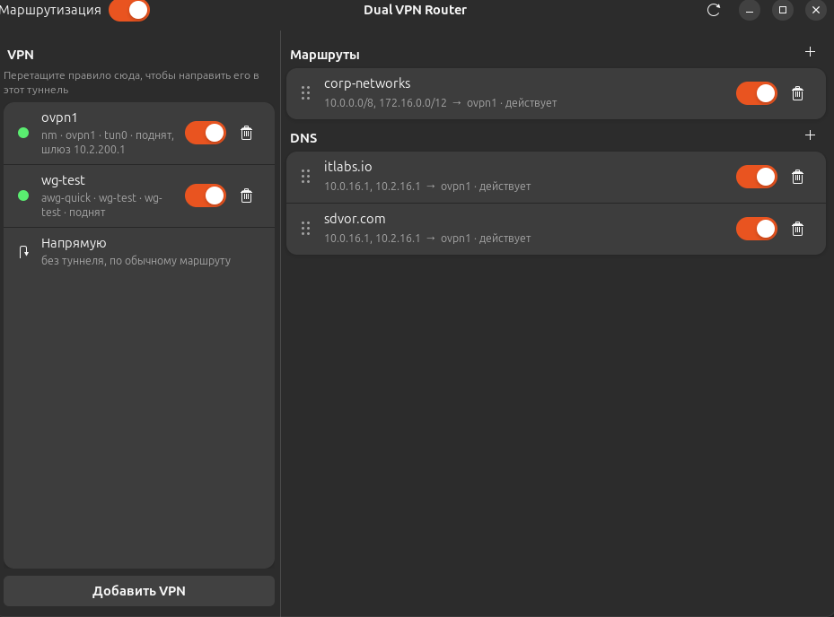
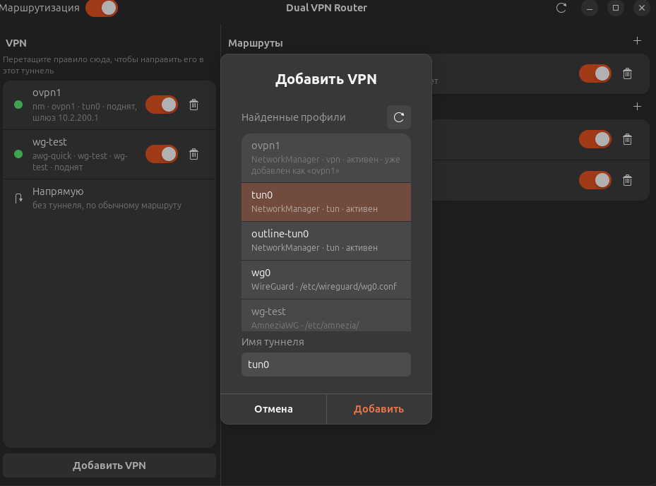
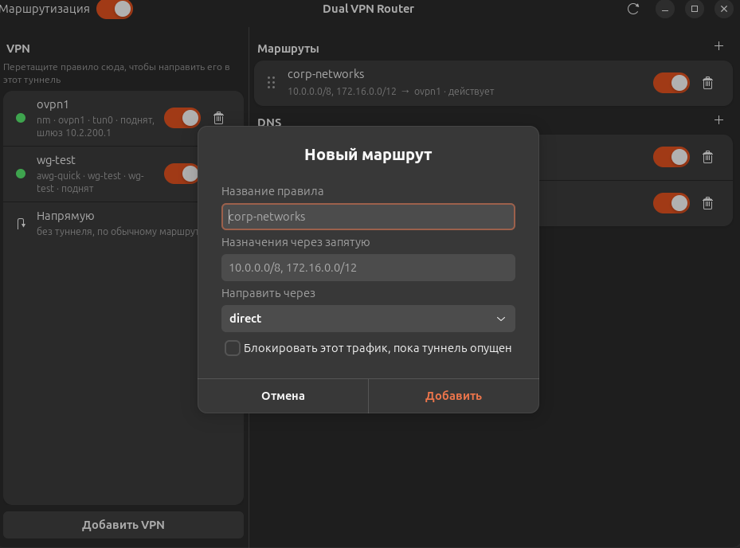
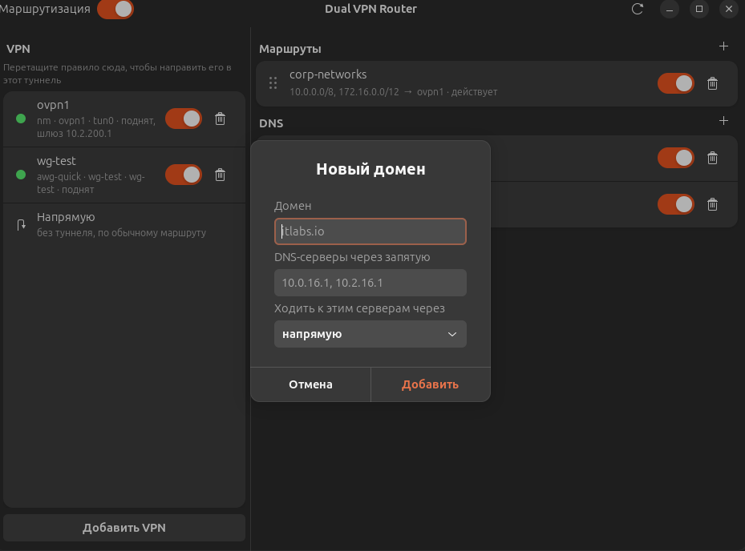

# dual-vpn-router

**Split tunneling для Linux** — раздельное туннелирование VPN.

Вы выбираете, какой трафик идёт в какой туннель, а какой — напрямую. Без ручной правки `AllowedIPs`, таблиц `ip rule` и systemd-resolved.



## Какую проблему решает

Когда на машине подняты два VPN — рабочий и личный — оба пытаются забрать маршрут по умолчанию. Дальше знакомый сценарий: весь интернет уходит через корпоративный туннель, или внутренние домены перестают резолвиться, или связь пропадает совсем, пока не отключишь один из туннелей.

Руками это чинится через `AllowedIPs` в WireGuard, `route-nopull` в OpenVPN, отдельные таблицы маршрутизации и per-interface домены в systemd-resolved. Работает — но разваливается после каждого переподключения туннеля или выхода из suspend.

Здесь то же самое описывается декларативно: правила задаются один раз, демон удерживает состояние и восстанавливает его, когда туннель поднимается заново.

Подходит, если нужно:

- держать рабочий и личный VPN одновременно;
- ходить в корпоративные подсети и внутренние домены, не заворачивая туда весь интернет;
- раскидать трафик между несколькими туннелями по назначению.

## Возможности

- **Раздельная маршрутизация (PBR)** — подсети по списку CIDR направляются в выбранный туннель, остальное идёт напрямую
- **Split DNS** — домен резолвится через свои DNS-серверы, а запросы к ним идут через нужный туннель
- **Fail-closed** — трафик правила можно блокировать, пока туннель опущен, чтобы он не утёк в открытую сеть
- **Управление туннелями** — подъём и остановка NetworkManager, WireGuard и AmneziaWG профилей
- **Автообнаружение** — существующие VPN-профили находятся сами, интерфейс подхватывается после reconnect
- **GUI и CLI** — графическое приложение поверх того же демона, что и командная строка
- **YAML-конфигурация** — человекочитаемый формат, версионируется и переносится

## Как это выглядит

### 1. Главное окно


Слева — туннели и их состояние: тип профиля, интерфейс, шлюз. Отдельным пунктом идёт **Напрямую** — маршрут в обход всех туннелей.

Справа — два списка правил. **Маршруты** направляют подсети в туннель, **DNS** переопределяет резолвинг отдельных доменов. Любое правило переключается тумблером, а перетаскиванием его можно перекинуть в другой туннель.

Тумблер **Маршрутизация** в заголовке — общий выключатель: снимает всё, что программа установила в систему, не трогая сами VPN-соединения.

### 2. Добавить туннель



Профили ищутся автоматически: подключения NetworkManager, конфиги из `/etc/wireguard` и `/etc/amnezia`. Уже добавленные показываются неактивными, так что один профиль не попадёт в список дважды. Остаётся выбрать профиль и задать имя туннеля — под ним он будет фигурировать в правилах.

### 3. Новый маршрут



Правило маршрутизации — это список подсетей и туннель, в который они направляются. Назначения перечисляются в CIDR через запятую, `Направить через` выбирает туннель или `direct`.

Галочка **Блокировать этот трафик, пока туннель опущен** включает fail-closed: если туннель упал, пакеты к этим подсетям отбрасываются вместо того, чтобы уйти в обычный канал. Для корпоративных сетей это стоит включать.

### 4. Новый домен



Здесь настраивается split DNS. `Домен` — зона, которую нужно резолвить особым образом, `DNS-серверы` — адреса, которые за неё отвечают, `Ходить к этим серверам через` — туннель, по которому идут сами запросы к этим серверам.

Последний пункт важен: внутренние DNS-серверы обычно доступны только изнутри корпоративной сети, поэтому запрос к ним должен идти через корпоративный туннель, даже если сам домен резолвится в публичный адрес.

## Установка

```bash
git clone https://github.com/maaxnikolaevich/dual-vpn-router.git
cd dual-vpn-router
sudo ./packaging/install.sh
```

Скрипт собирает оба бинарника, ставит их в `/usr/local/bin`, создаёт группу `dual-vpn`, добавляет в неё текущего пользователя, включает systemd-юнит и кладёт `.desktop`-файл.

Группа нужна, чтобы GUI управлял демоном без запроса пароля на каждое переключение. **После первой установки нужно перелогиниться**, иначе членство в группе не применится и GUI не достучится до демона.

Зависимости сборки: `golang-go`, `libgtk-4-dev`, `libadwaita-1-dev`, `libgirepository1.0-dev`, `dnsmasq`. Скрипт проверяет их до начала сборки.

### Вручную

```bash
go build -o dual-vpn ./cmd/dual-vpn
go build -o dual-vpn-gui ./cmd/dual-vpn-gui
```

## Быстрый старт

```bash
# 1. Создать конфигурацию
sudo dual-vpn init

# 2. Отредактировать под свои туннели и сети
sudo nano /etc/dual-vpn/config.yaml

# 3. Применить
sudo dual-vpn start

# 4. Проверить
dual-vpn status
```

Либо запустить `dual-vpn-gui` и добавить туннели и правила через интерфейс — конфигурация запишется сама.

Демон сам поднимает туннели, помеченные к запуску, поэтому подключать VPN заранее не нужно. Раз в интервал он сверяет систему с конфигурацией и восстанавливает маршруты, если туннель переподключился.

При выходе демон намеренно **не** снимает маршрутизацию: иначе перезапуск или падение демона молча выбросили бы трафик из туннеля в открытую сеть. Чтобы убрать всё установленное, выполните `dual-vpn stop`.

## Команды

| Команда | Описание |
|---------|----------|
| `dual-vpn init` | Создать конфигурацию по умолчанию |
| `dual-vpn status` | Показать туннели, правила маршрутизации и DNS-переопределения |
| `dual-vpn start` | Применить маршрутизацию и DNS |
| `dual-vpn stop` | Убрать всё, что программа установила в систему |
| `dual-vpn apply` | Привести систему в соответствие с конфигурацией |
| `dual-vpn daemon` | Запустить управляющий демон (нужен root) |
| `dual-vpn tunnel up\|down <имя>` | Поднять или опустить туннель |
| `dual-vpn rule enable\|disable <id>` | Включить или выключить правило маршрутизации |
| `dual-vpn rule target <id> <туннель\|direct>` | Перенаправить правило в другой туннель |
| `dual-vpn dns enable\|disable <домен>` | Включить или выключить DNS-переопределение |

Старые `setup` и `cleanup` продолжают работать как псевдонимы `start` и `stop`.

Общие флаги: `--config` (по умолчанию `/etc/dual-vpn/config.yaml`) и `--socket` (управляющий сокет демона).

## Конфигурация

`sudo dual-vpn init` создаёт заготовку в `/etc/dual-vpn/config.yaml` со значениями-заполнителями. Их нужно заменить на свои.

```yaml
version: 2

dns:
    listen_addr: 127.0.0.1
    fallback:
        - 8.8.8.8
        - 8.8.4.4

tunnels:
    - name: corp                  # имя, по которому на туннель ссылаются правила
      kind: nm                    # nm | wg-quick | awg-quick | manual
      profile: corporate-vpn      # профиль NetworkManager или имя .conf
      table_id: 200               # своя таблица маршрутизации, у каждого туннеля уникальная
      auto_detect: true
    - name: global
      kind: wg-quick              # /etc/wireguard/wg0.conf
      profile: wg0
      table_id: 201
      auto_detect: true

rules:
    - id: corp-networks
      target: corp                # имя туннеля или direct
      cidrs:
        - 10.0.0.0/8
        - 172.16.0.0/12
      enabled: true
      fail_closed: true           # отбрасывать трафик, пока туннель опущен
      comment: Внутренние сети

dns_rules:
    - domain: corporate.example.com
      servers:
        - 192.168.1.1
      via: corp                   # через какой туннель идти к этим DNS-серверам
      enabled: true
```

### Что нужно поменять

1. **`tunnels[].profile`** — реальные имена ваших профилей. Для `nm` это имя подключения из `nmcli connection show`, для `wg-quick` — имя файла в `/etc/wireguard` без расширения, для `awg-quick` — в `/etc/amnezia/amneziawg`.
2. **`rules[].cidrs`** — подсети, которые должны ходить через туннель.
3. **`dns_rules`** — внутренние домены и адреса DNS-серверов, которые за них отвечают.

### Типы туннелей

| `kind` | Чем управляется |
|--------|-----------------|
| `nm` | Профиль NetworkManager через `nmcli` |
| `wg-quick` | `/etc/wireguard/<profile>.conf` через `wg-quick` |
| `awg-quick` | `/etc/amnezia/amneziawg/<profile>.conf` через `awg-quick` (AmneziaWG) |
| `manual` | Туннель только наблюдается, программа его не поднимает и не опускает |

### Параметры

| Параметр | Описание | Пример |
|----------|----------|--------|
| `dns.listen_addr` | Адрес, на котором dnsmasq принимает запросы | `127.0.0.1` |
| `dns.fallback` | DNS-серверы для всех прочих доменов | `8.8.8.8` |
| `tunnels[].name` | Имя туннеля, на которое ссылаются правила | `corp` |
| `tunnels[].kind` | Способ управления туннелем | `wg-quick` |
| `tunnels[].profile` | Имя профиля или конфига | `wg0` |
| `tunnels[].table_id` | ID таблицы маршрутизации, уникальный для туннеля | `200` |
| `tunnels[].auto_detect` | Определять интерфейс автоматически | `true` |
| `rules[].id` | Идентификатор правила | `corp-networks` |
| `rules[].target` | Туннель назначения или `direct` | `corp` |
| `rules[].cidrs` | Подсети, попадающие под правило | `10.0.0.0/8` |
| `rules[].fail_closed` | Блокировать трафик при опущенном туннеле | `true` |
| `dns_rules[].domain` | Домен с особым резолвингом | `corp.example.com` |
| `dns_rules[].servers` | DNS-серверы для этого домена | `192.168.1.1` |
| `dns_rules[].via` | Туннель до этих DNS-серверов | `corp` |

Конфигурации первой версии (со схемой `vpns:` и `routing.corp_networks`) читаются и переносятся в новый формат автоматически.

## Как это устроено

1. **Маршрутизация** — у каждого туннеля своя таблица маршрутизации, `ip rule` направляет в неё подсети из правил
2. **DNS** — dnsmasq резолвит перечисленные домены через указанные серверы, fwmark заворачивает запросы к ним в нужный туннель
3. **Демон** — держит состояние, периодически сверяет систему с конфигурацией и чинит маршруты после переподключения туннеля
4. **Управляющий сокет** — unix-сокет, принадлежащий группе `dual-vpn`; через него работают и CLI, и GUI

## Требования

- Linux (Ubuntu/Debian/Arch)
- systemd
- dnsmasq
- iproute2, iptables
- NetworkManager — для туннелей типа `nm`
- wireguard-tools — для `wg-quick`
- GTK 4 и libadwaita — для GUI

## Лицензия

MIT License

## Развитие

Правки и поиск багов приветствуются. Не стесняйтесь отправлять Pull Request.

## Ключевые слова

split tunneling, раздельное туннелирование vpn, разделение трафика vpn, какие сайты через какой vpn, linux, vpn, pbr, policy based routing, dual vpn, split routing, подключить два впн одновременно, два впн на одном компьютере, ip routing, dns routing, настройка двух vpn, split dns, политика маршрутизации, два vpn на linux, корпоративный vpn и личный vpn одновременно, wireguard split tunnel, openvpn split tunnel, amneziawg
